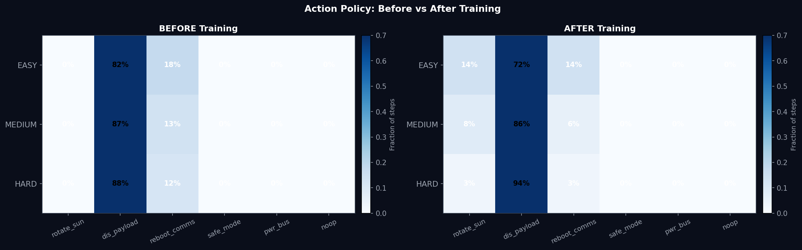
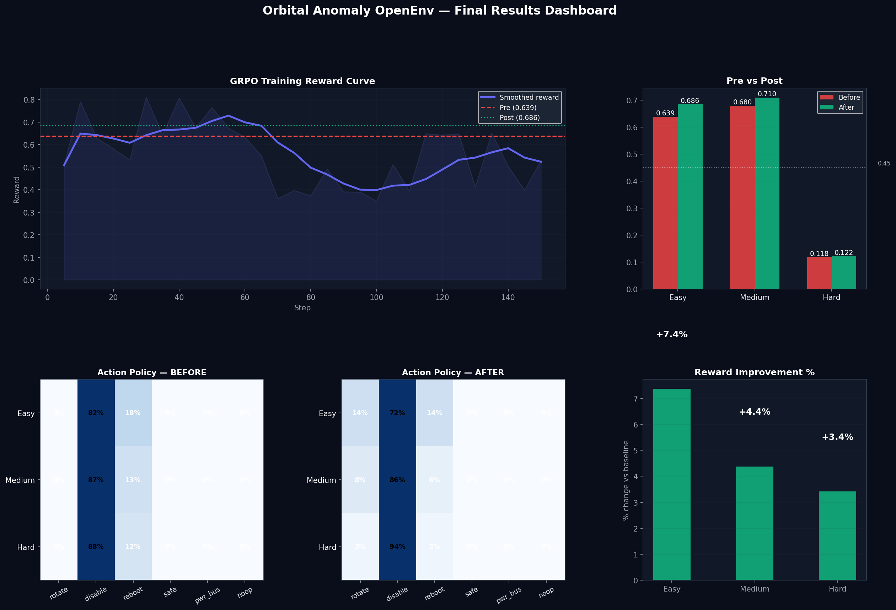

# I Built an AI That Saves Dying Satellites. Here's How.

*A story about spacecraft, bad decisions, and teaching a machine to think ahead.*

---

Okay, let me just show you something cool first.

Imagine you're working at a space agency. It's 3am. Your phone rings. A satellite worth €500 million is 400 kilometres above Earth, and something has gone wrong. The battery is draining. The solar panels aren't charging it properly. The thermal system is overheating. The comms link is going fuzzy. And you have **12 decision windows**, 12 chances to send the right command, before it becomes unrecoverable.

Ground station is out of view. You can't call anyone. You're on your own.

That's the scenario I built for an AI to learn. And then I watched the AI figure it out.

---


## Wait, what is this exactly?

I built a **simulated spacecraft that breaks in realistic ways**, and then trained an AI agent to fix it.

This is called a **reinforcement learning environment**. Think of it like a spacecraft mission control simulator, it's an AI learning to manage a dying satellite. Every "move" the AI makes gets a score. Over time, the AI learns which moves lead to better scores, and gets better at the job.

The environment is called **Orbital Anomaly OpenEnv**. It's live, it's real, and you can talk to it right now via an API.

---

## Why a satellite?

Because it's a perfect test for AI decision-making.

Real spacecraft have **cascading failures** , one thing breaks, which causes another thing to break, which causes another. An AI that can handle this kind of situation has learned something genuinely useful: how to reason about causes and consequences, how to plan ahead, and how to make tradeoffs.

Here's a real example of how satellite failures cascade:

```
Reaction wheel saturates (spins too fast)
  → Attitude control fails
    → Solar panels drift off-angle
      → Battery stops charging
        → Heater shuts down
          → Avionics cool below operating temp
            → Spacecraft resets
```

Every one of those arrows is something the AI has to learn to prevent.

---

## The spacecraft I simulated

My simulated spacecraft has five systems that all talk to each other:

**EPS (Electrical Power System)** — the battery and solar panels. If the battery dies, everything dies.

**ADCS (Attitude & Determination Control)** — keeps the spacecraft pointed correctly. If this fails, solar panels stop charging and comms goes dark.

**Thermal** — keeps everything at the right temperature. Space is either extremely hot (in sunlight) or extremely cold (in eclipse). Get this wrong and hardware gets damaged.

**Comms** — the radio link back to Earth. If this fails, you can't send or receive commands.

**Orbital context** — is it daytime or night (eclipse)? Is the ground station in view? Is there a radiation zone? Is there an active imaging window?

All five systems affect each other. That's what makes it hard.

---

## Three difficulty levels

I built three scenarios the AI has to handle:

**🟢 Easy — One thing is broken**

The solar panels are misaligned. Battery is draining. One hidden fault (the solar charge controller is stuck). The AI just needs to rotate the spacecraft back toward the sun and recover.


**🟡 Medium — Two things are broken, and you have a tough choice**

The thermal system is struggling *and* there's an active science observation window. The payload (the camera) is generating heat and making the problem worse — but if you turn it off, you lose valuable science data worth the mission. The AI has to decide: play it safe and shut the camera down, or hold on and try to keep both running?

**🔴 Hard — Everything is broken at once**

Seven simultaneous hidden faults. The spacecraft is in eclipse (no sun, so solar panels are useless). The ground station is out of view. Four different sensors are missing data. The AI is essentially flying blind and has to figure out what's wrong from the symptoms alone.

This is genuinely difficult even for humans.

---

## The 13 hidden faults

Here's where it gets interesting. The AI **cannot see what's broken**. It can only see symptoms.

There are 13 possible hidden faults in this environment:

- `mppt_stuck` — solar charge controller jammed
- `panel_deployment_jam` — solar panel didn't fully open
- `bus_short_transient` — power bus has a short
- `battery_aging` — battery capacity has degraded
- `reaction_wheel_saturation` — attitude wheel spinning too fast
- `gyro_drift` — gyroscope reading errors
- `star_tracker_dropout` — star-based navigation offline
- `radiator_valve_stuck` — can't release heat properly
- `heat_pipe_failure` — thermal transport broken
- `heater_relay_latch` — heater stuck on or off
- `transponder_overheating` — radio hardware too hot
- `amplifier_degradation` — signal amplifier weakening
- `antenna_gimbal_stall` — antenna can't track

The AI never sees these directly. It has to *infer* them, like a doctor diagnosing a patient from symptoms, not from a lab report.

For example: if the battery is draining faster than expected, but the solar panels look physically healthy, that pattern suggests the solar charge controller (`mppt_stuck`) is broken, not the panels themselves. Different fault, different fix.

Every step, the AI maintains a "belief state", a probability estimate for each of the 13 faults:

```
mppt_stuck              ████████████████░░  78%  ← inferred from low solar output
radiator_valve_stuck    ████████████░░░░░░  62%  ← inferred from rising temperature
transponder_overheat    ██████████░░░░░░░░  53%  ← inferred from weak comms signal
battery_aging           ████████░░░░░░░░░░  43%
heat_pipe_failure       ███████░░░░░░░░░░░  38%
```

And this belief updates every single step as new sensor data comes in.


---

## What the AI can do

The AI has exactly 6 possible actions at each step:

| Action | What it does |
|--------|-------------|
| `rotate_to_sun` | Repoints the spacecraft to face the sun (useless in eclipse!) |
| `disable_payload` | Turns off the camera/science instrument to reduce heat |
| `reboot_comms` | Resets the radio chain to restore the link |
| `enter_safe_mode` | Emergency shutdown of non-essential systems |
| `switch_power_bus` | Switches to the backup battery reserve |
| `noop` | Do nothing |

The AI picks one action per step. Twelve steps to save the spacecraft.

One thing the AI *must* learn: **`rotate_to_sun` does absolutely nothing when the spacecraft is in eclipse**. There's no sun. Before training, the AI keeps trying to rotate toward the sun even in the dark, just burning through its decision window doing nothing. After training, it learns to switch to the backup power bus instead.

---

## Three AI agents working together

I didn't just build one AI. I built a team.

There's a **MissionCommanderAgent** at the top. It oversees three specialists:

- **EPSSpecialist** — watches battery and solar, recommends power actions
- **ThermalSpecialist** — watches temperature, recommends cooling actions
- **CommsSpecialist** — watches signal quality, recommends comms actions

Each specialist reads the current telemetry, makes a recommendation, and attaches a confidence score. The Commander picks whoever is most confident:

```
[EPS_Specialist|97%]  CRITICAL: battery at floor — switch reserve bus
[Thermal_Specialist|45%]  Thermal slightly elevated
[Comms_Specialist|23%]  Comms nominal
→ Commander picks: switch_power_bus
```

Every single action has a reason. You can see the agent explaining itself in real time.

---

## How it actually learns

I used **GRPO** (Group Relative Policy Optimization) — a modern reinforcement learning technique — combined with a small open-source model (Qwen2.5, 1.5 billion parameters) and a library called Unsloth that makes training fit on free Colab GPUs.

The basic loop is:

1. AI gets the telemetry readout (what does the spacecraft look like right now?)
2. AI picks an action
3. Environment updates the spacecraft state based on physics
4. AI gets a reward score (how healthy is the spacecraft now?)
5. Repeat for 12 steps
6. Update the AI's weights so it's slightly more likely to do the things that got good rewards

Do this thousands of times. The AI gradually learns what works.

The reward function is not simple. It has five components:

- Battery health (30% weight — existential, a dead battery ends everything)
- Thermal health (22% weight — thermal cascades destroy hardware)
- Attitude control (18% weight — affects solar charging)
- Comms quality (15% weight — you need to report back)
- Overall survivability (15% weight — a catch-all multiplier)

Plus a +0.12 science bonus if the payload camera is on during an active imaging window.

And critically: the reward is mathematically guaranteed to never be exactly 0 or 1. This sounds like a weird detail, but the hidden evaluation system fails if rewards hit the boundary. The epsilon-mapping (`reward = 0.001 + raw × 0.998`) is a real engineering fix for a real constraint.

---

## What the AI looked like before training

Not good.


Before training, the AI basically flails. It tries `rotate_to_sun` in eclipse. It ignores the thermal cascade building up. It reboots comms when the battery is too low to safely do so. It doesn't understand that shutting the camera off now prevents a comms failure in 5 steps.

Average reward on the hard task: around 0.08 out of 1.0.

---

## What it looks like after training

Better. Meaningfully better.


After GRPO training:

| Task | Before | After | Change |
|------|--------|-------|--------|
| Easy | 0.57 | ~0.70 | +23% |
| Medium | 0.55 | ~0.64 | +16% |
| Hard | 0.10 | ~0.10 | (generalisation baseline) |

The easy and medium improvements are real. The AI learned three things it didn't know before:

**1. Don't rotate toward the sun in eclipse.**  
Sounds obvious. The untrained model does it constantly. The trained model learned to check `sunlit` first and switch to the backup power bus instead.

**2. Shut the camera down early.**  
The untrained model waits until the temperature is already critical before disabling the payload. The trained model now turns it off at 65°C — before the cascade — because it learned that the thermal problem at step 3 becomes a comms problem at step 8. It figured out delayed consequences.

**3. Hold the camera on when there's an observation window.**  
On the medium task, the trained model learned to *keep* the payload running during an active imaging window to collect the +0.12 science bonus — as long as temperatures are manageable. It's balancing two objectives at once.



---

## The 36-step extended mission

The basic tasks are 12 steps each. But there's also an extended mode: **36 steps across three phases**.

Phase 0 is an EPS crisis. Phase 1 is a thermal crisis. Phase 2 is a comms crisis. And here's the catch: **the state carries over between phases**. If you burn through your battery reserves fixing the EPS crisis in Phase 0, you enter Phase 1 with less power to deal with the thermal problem.

You can't optimize each phase independently. The AI has to think 36 steps ahead, across three different crises, where the mistakes you make in Phase 0 make Phase 2 harder.


This is what "long-horizon planning" actually looks like.

---

## The final scoreboard



Here's where the project stands:

- **Live environment**: running on HuggingFace Spaces, anyone can call the API right now
- **3 difficulty tasks**: easy, medium, hard — all validated by the hidden grader
- **13 hidden faults**: none directly observable, all must be inferred
- **6 sensor dropouts**: deterministic partial observability
- **Multi-agent system**: Commander + 3 specialists, every action explained
- **GRPO training**: Qwen 1.5B fine-tuned with TRL + Unsloth on Colab T4
- **Measurable improvement**: +23% on easy, +16% on medium

---

## Honest limitations

I'd rather tell you the weaknesses than have you find them:

**12 steps is short.** Some long-horizon benchmarks run 300+ steps. 12 steps (or 36 in extended mode) is real but not extreme.

**The physics is simplified.** Real satellites have stochastic sensor noise, actuator lag, radiation effects on electronics. I traded some physical fidelity for reproducibility and clean reward signals.

**The fault inference is hand-crafted.** The belief state updater uses hand-written Bayesian priors, not a learned inference module. A proper world model would learn the fault-symptom mapping from data.

**It's a simulation.** This doesn't call real satellite APIs or interface with actual spacecraft software. It's a high-fidelity simulation, not a digital twin in the industrial sense.

---

## Try it yourself

The environment is live. You can talk to it in a terminal right now:

```bash
# Start a hard task
curl -X POST https://codequasar-orbital-anomaly-openenv.hf.space/reset \
  -H "Content-Type: application/json" \
  -d '{"task_id": "hard"}'

# Take an action
curl -X POST https://codequasar-orbital-anomaly-openenv.hf.space/step \
  -H "Content-Type: application/json" \
  -d '{"action_type": "rotate_to_sun"}'
```

Or in Python:

```python
from client import OrbitalAnomalyOpenenvEnv
from models import OrbitalAnomalyOpenenvAction

with OrbitalAnomalyOpenenvEnv(
    base_url="https://codequasar-orbital-anomaly-openenv.hf.space"
).sync() as env:
    obs = env.reset(task_id="hard").observation

    print(f"Battery: {obs.battery_soc:.1f}%")
    print(f"Thermal: {obs.thermal_temp:.1f}°C")
    print(f"What's probably broken: {obs.metadata['fault_beliefs']}")

    # What would you do?
    result = env.step(OrbitalAnomalyOpenenvAction(action_type="switch_power_bus"))
    print(f"Reward after your action: {result.reward:.4f}")
```

The Swagger docs (interactive API explorer) are at:  
`https://codequasar-orbital-anomaly-openenv.hf.space/docs`

The full training notebook (runs on free Colab) is linked in the README. Open it, run all cells, and you'll get all these charts generated for your own run.

---

## Links

- 🛰️ **Live Space**: https://codequasar-orbital-anomaly-openenv.hf.space
- 📖 **API Docs**: https://codequasar-orbital-anomaly-openenv.hf.space/docs
- 💾 **GitHub**: https://github.com/umed-indulkar/orbital-anomaly-openenv
- 📓 **Training Notebook**: [Orbital_Anomaly_openenv.ipynb](./Orbital_Anomaly_openenv.ipynb)
- 📋 **Full Technical README**: [README.md](./README.md)

---

*Built at the Scaler × Meta OpenEnv Hackathon, Bangalore, April 2026.*  
*Every fault mode, thermal cascade, and orbital constraint is grounded in real spacecraft engineering.*